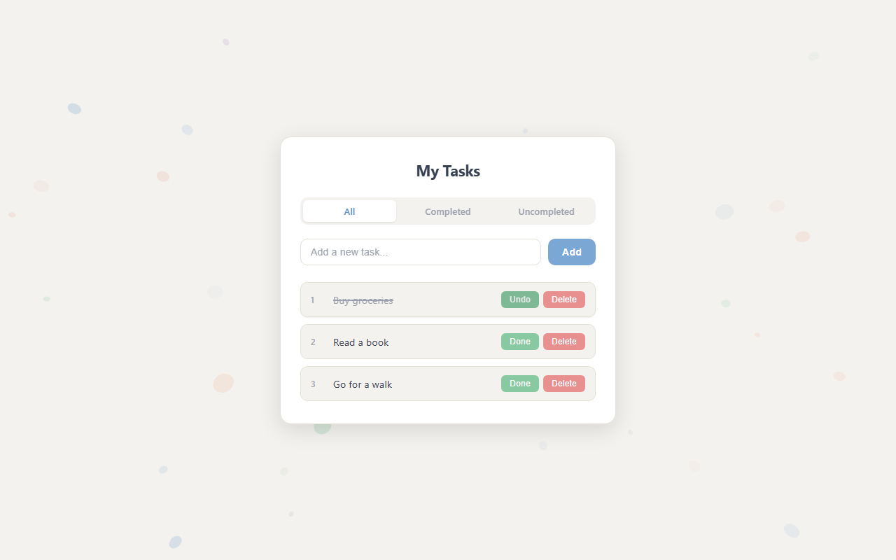

# TodoExam

A minimal todo app built with React 18 and Vite, featuring a Three.js animated particle background and localStorage persistence.



## Tech Stack

| Layer | Library / Tool |
|---|---|
| UI | React 18 |
| Build | Vite 5 |
| 3D Background | Three.js 0.185 |
| Styling | Pure CSS (custom properties, no framework) |
| Persistence | `localStorage` |
| Linting | ESLint 9 |

## Getting Started

```bash
npm install
npm run dev
```

The app runs at `http://localhost:5173`.

## Commands

| Command | Description |
|---|---|
| `npm run dev` | Start dev server with HMR |
| `npm run build` | Production build to `dist/` |
| `npm run preview` | Serve the production build locally |
| `npm run lint` | Run ESLint |

## Architecture

### State

All state lives in `Todo.jsx`. The state shape is:

```js
{
  allTodo: [{ id, item, complated }],  // source of truth
  filteredTodo: []                      // derived view, re-computed on every mutation
}
```

`filteredTodo` is never stored independently — every add, delete, toggle, or filter change calls `applyFilter(allTodo, activeFilter)` and replaces it. The whole object is written to `localStorage` under the key `'todo'` on every state update via a `useEffect`.

### Components

```
App
├── ThreeBackground   fixed canvas behind everything, pointer-events: none
└── Todo              owns all state
    ├── FilterTodo    three radio buttons (All / Completed / Uncompleted)
    ├── TodoInput     controlled text input + Add button; Enter key also submits
    └── TodoItem      renders filteredTodo with staggered fade-up animation
```

### Delete Confirmation

`TodoItem` manages a local `confirmId` state. Clicking Delete sets `confirmId` to that item's id, replacing the action buttons with a "Delete? Yes / No" prompt. Confirming calls the parent's `handleDeleteBtn`; cancelling resets `confirmId` to null.

### Three.js Background

`ThreeBackground.jsx` spawns 45 semi-transparent spheres in five muted colors (`#7BA7D4`, `#88C9A1`, `#C4A8D4`, `#E8B4A0`, `#A8C4D4`) using `MeshBasicMaterial` with opacity between 0.06 and 0.28. Each sphere drifts independently with a sine/cosine position update keyed to a per-sphere phase offset. The renderer is mounted into a `ref` div and torn down cleanly on unmount (`cancelAnimationFrame`, `renderer.dispose()`).

### CSS

Styles are token-driven via CSS custom properties defined in `index.css`. No gradients — all fills use flat solid colors. Animations: `scale-in` on the card mount, `fade-up` on each todo item (staggered by `index * 60ms`), `fade-in` on the empty state. All animations are suppressed under `prefers-reduced-motion: reduce`.

## Project Structure

```
src/
  component/
    FilterTodo.jsx       radio-button filter bar
    ThreeBackground.jsx  Three.js canvas overlay
    Todo.jsx             state owner, composes all other components
    TodoInput.jsx        controlled input + add button
    TodoItem.jsx         list renderer with inline delete confirmation
  App.jsx                root: mounts ThreeBackground + Todo
  index.css              all styles and CSS tokens
  main.jsx               React DOM entry point
```
